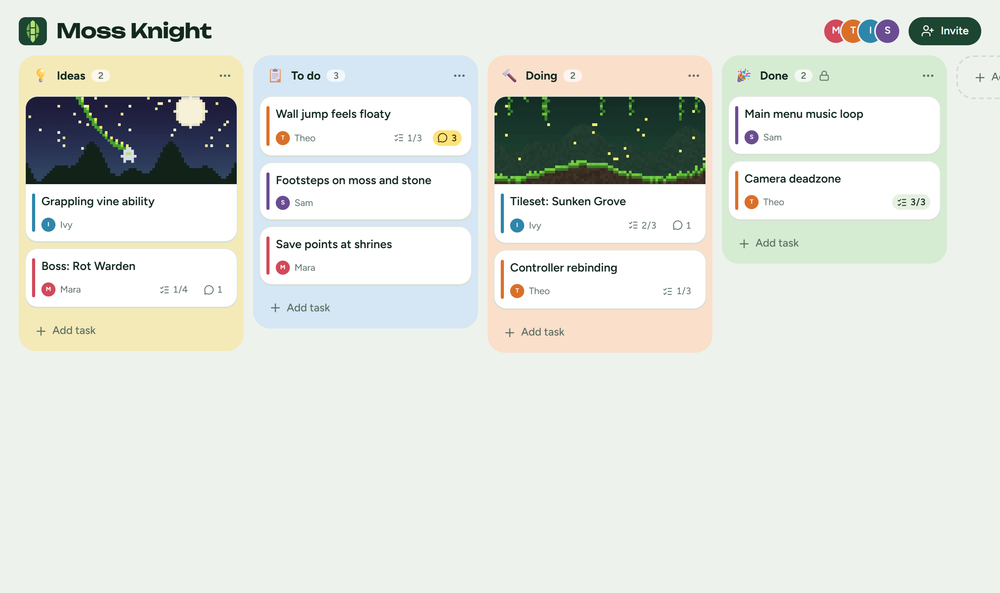
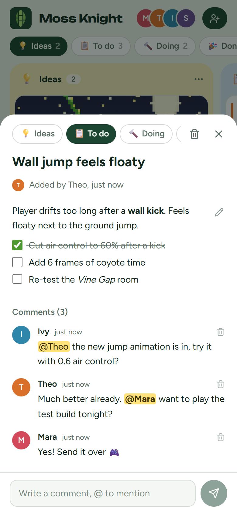
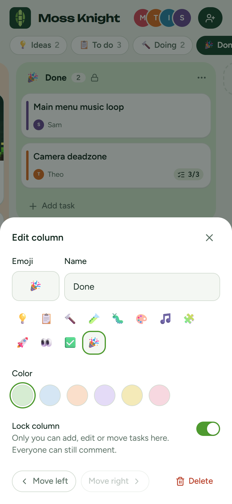
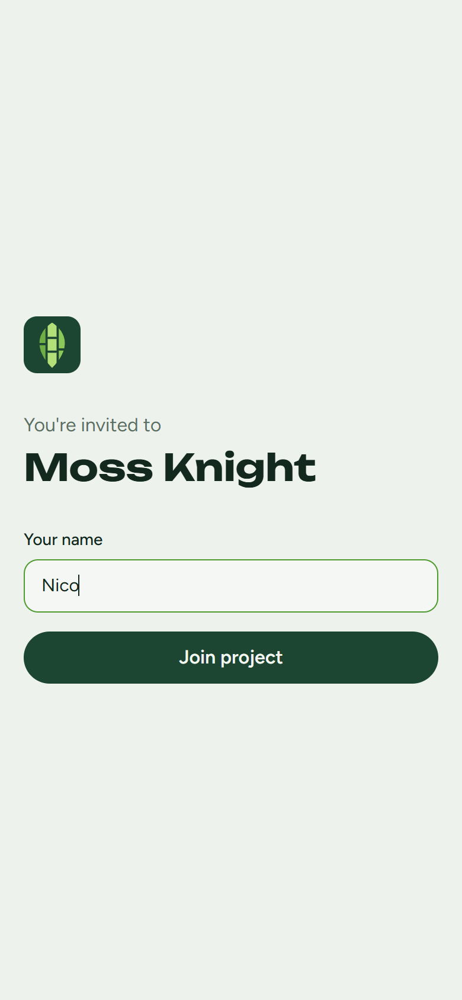
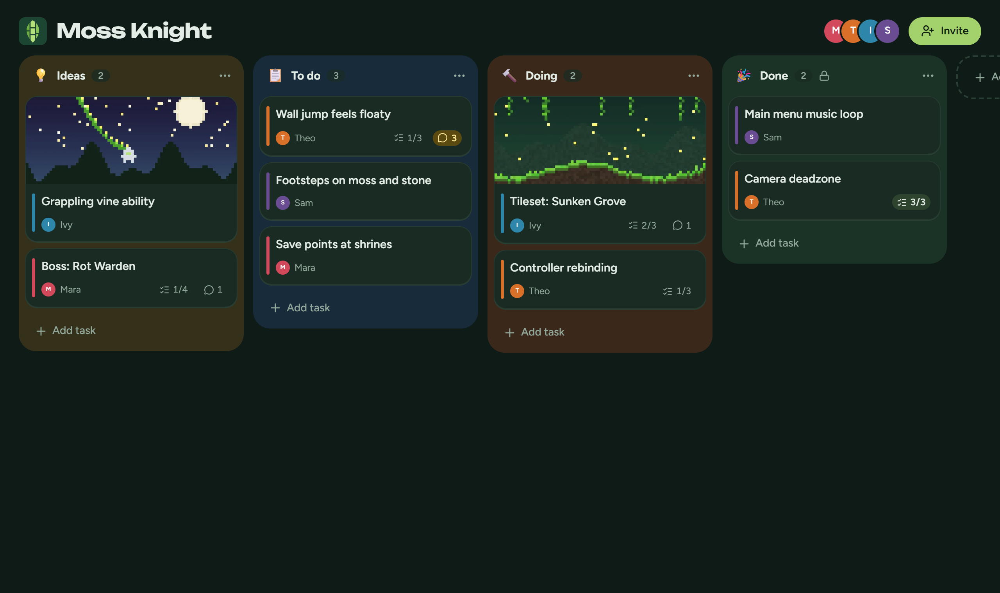

<p align="center"></p>

<h1 align="center">Midori</h1>

<p align="center">
  A small, friendly kanban board for making games with friends.<br>
  Make a project, share the link, and everyone's in. No sign-up needed.
</p>

<p align="center"><b><a href="https://g1lg1l.github.io/midori/">Open Midori</a></b></p>

<p align="center"></p>

<p align="center">
  
  
  
  
</p>

## What it does

- **No sign-up needed.** Every device gets its own guest identity the first time it opens Midori. Friends join a project from an invite link and pick a name.
- **Optional accounts.** Anyone can save a username and password, then sign in on another device and find the same projects, with the master role included. No email is involved.
- **The master runs the board.** Whoever creates a project is its master. They can:
  - add, rename, reorder and delete columns, and give each one an emoji and a colour;
  - **lock** a column, so only the master can add, edit or move tasks in it (members can still comment);
  - choose whether members can edit everyone's tasks or only their own;
  - reset the invite link, or delete the project.
- **Members** add tasks, edit and move their own, and comment on every task.
- **Markdown task details** with checklists you tick right in the rendered view. Cards show checklist progress (`2/3`).
- **Tiny images.** Paste or pick an image in a task's details. It's shrunk to at most 800 px and 150 KB before upload, and the first image becomes the card's cover.
- **@mentions** in comments, highlighted. A card's comment badge turns yellow when someone mentions you.
- **Realtime.** Changes from the rest of the team show up as they happen.
- **Mobile first.** Column tabs and swipe on phones, drag and drop on desktop, light and dark themes.
- **Installable.** On Android, tap Install on the home page. On iPhone, tap Share, then Add to Home Screen. Either way it opens full screen, like an app.

<p align="center"></p>

## Who can do what

The database enforces all of this with row-level security, not just the UI.

| | Master | Member | Anyone else |
|---|---|---|---|
| See the board | ✓ | ✓ | |
| Manage columns, invite link, project | ✓ | | |
| Add tasks | ✓ | in unlocked columns | |
| Edit, move, delete a task | any task | their own, or any if the master allows it, never in locked columns | |
| Comment and @mention | ✓ | ✓ | |
| Upload images | ✓ | ✓ | |

## Stack

React, Vite, TypeScript and Tailwind on GitHub Pages. Supabase provides anonymous auth, Postgres with RLS, Realtime and Storage.

## Run it locally

```bash
npm install
npm run dev
```

Then open http://localhost:5173/midori/. The app talks to the Supabase project set in [`.env`](.env). That file only holds public values; the publishable key is meant to be shipped to browsers.

### Use your own Supabase project

1. Create a project, then log in and link it:
   ```bash
   npx supabase login
   npx supabase link
   ```
2. Apply the schema and the auth settings: anonymous sign-ins on, email confirmation off for username accounts. Set `site_url` in [`supabase/config.toml`](supabase/config.toml) first:
   ```bash
   npx supabase db push
   npx supabase config push
   ```
3. Put your project URL and publishable key in `.env`, then regenerate the types with `npm run types`.

### Checks

```bash
npm run check
npm run check:rls
```

`check` tests the text helpers: mentions, checklists and card ordering. `check:rls` signs in three anonymous users against the linked project and tries everything each one should and shouldn't be able to do. It deletes its test project afterwards, but leaves the three anonymous users in Auth.

## Deploy

Every push to `main` builds and publishes to GitHub Pages via [`.github/workflows/deploy.yml`](.github/workflows/deploy.yml).

## Good to know

- **Guests live in the browser.** Clearing site data on a guest device means starting over there, so masters should save an account.
- **Usernames are stored as `name@example.com` logins.** That domain is reserved, so no mail is ever sent. Supabase just needs an email-shaped login.
- **Images are public links.** They aren't listed anywhere, but anyone with the URL can see one.
- **Deleting tasks keeps their images.** They're only removed when the whole project is deleted. Each project can hold at most 300 images.
- **Don't auto-delete anonymous users** in Supabase: that would delete their projects too.

## License

[MIT](LICENSE)
